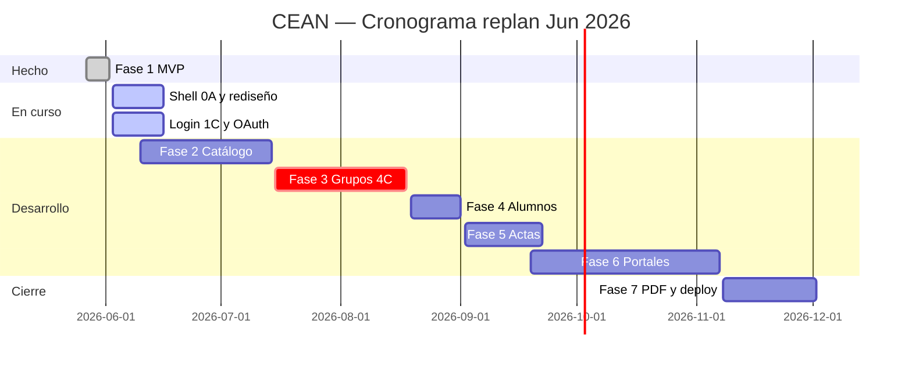

# CEAN — Proyecto ejecutivo

**Control Escolar y Administración Normalista**  
Escuela Normal Superior de Querétaro (ENSQ)

| Campo | Valor |
|-------|-------|
| **Versión documento** | 1.1 |
| **Fecha** | 3 Jun 2026 (replanificación) |
| **Estado global** | Fase 1 operativa · Fase 2 en curso (desde 3 Jun) · Stitch admin oscuro |
| **Plan vigente** | [cean-modulos-notion.csv](./cean-modulos-notion.csv) · [Vista tablero](./cean-modulos-tablero.html) (`/modulos/tablero`) |
| **Documentos relacionados** | [DESIGN.md](./stitch/DESIGN.md) · [prompts.md](./stitch/prompts.md) · [flujo-proceso.md](./stitch/flujo-proceso.md) |

---

## 1. Resumen ejecutivo

CEAN es un sistema web para la gestión escolar de la ENSQ. Permite a **control escolar** administrar alumnos, grupos, materias, docentes y calificaciones; a **docentes** capturar evaluaciones de sus grupos asignados; y a **alumnos** consultar boletas oficiales de calificaciones.

**Hoy (Fase 1):** consulta **pública** de boletas (`/boleta`), login único personal (`/login`), dashboard admin e importación CSV.

**Autenticación objetivo:** un solo login para admin y docente (correo/contraseña + **Google OAuth** vía Google Workspace). Boletas siguen **públicas** sin cuenta.

**Objetivo (Fase 2–4):** plataforma completa con grupos escolares (materia + docente por salón), CRUD académico, portal docente, actas editables y diseño institucional CEAN (Stitch + Tailwind).

**Orden académico obligatorio:** Materias → Docentes → **Grupos** → Alumnos → Calificaciones.

---

## 2. Tecnologías

### Stack principal

| Capa | Tecnología | Uso |
|------|------------|-----|
| Backend | **PHP 8.3+** | Lógica de negocio |
| Framework | **Laravel 13** | MVC, auth, migraciones, colas |
| Frontend | **Blade** + **Tailwind CSS 3** | Vistas server-side |
| Auth / UI base | **Laravel Breeze** + **Laravel Socialite** | Login único, Google OAuth Workspace |
| Build | **Vite** + **npm** | Compilación CSS/JS |
| Tipografía | **Figtree / Montserrat** | UI web (Montserrat = marca CEAN) |
| Base de datos (dev) | **SQLite** | Desarrollo local |
| Base de datos (prod) | **MySQL** | Hosting compartido ENSQ |
| Servidor local | **Laravel Herd** | `cean.test` |
| Tests | **PHPUnit** | Feature tests |

### Diseño y documentación

| Herramienta | Uso |
|-------------|-----|
| **Google Stitch** | Prototipos UI, design system, prompts |
| **DESIGN.md** | Tokens de marca (cyan `#59C1E3`, navy `#2C5EAB`) |
| **Notion** | Seguimiento de avance (tablas de este documento) |
| **Git / GitHub** | Control de versiones |

### Infraestructura y despliegue

| Elemento | Detalle |
|----------|---------|
| Hosting | Compartido (cPanel/Plesk), document root → `public/` |
| Assets | `npm run build` en local, subir `public/build/` |
| Sesiones | File driver |
| Colas | Sync (sin Redis requerido en Fase 1) |
| PDF boletas | Fase futura (DomPDF / Browsershot — por definir) |

### Perfiles y autenticación

| Perfil | Método | Middleware |
|--------|--------|------------|
| **Boleta pública** | Matrícula + fecha nacimiento en `/boleta` | Ninguno (público) |
| **Admin + Docente** | Login único `/login`: email/contraseña o Google OAuth | `auth` + `admin` o `docente` |
| Alumno portal (Fase 2) | Opcional sesión propia | `auth`, `alumno` (futuro) |

**Google OAuth:** cuenta Google Workspace institucional; dominio permitido en `.env` (`GOOGLE_ALLOWED_DOMAIN`).

---

## 3. Tabla de módulos (para Notion)

Copia esta tabla a Notion o importa [cean-modulos-notion.csv](./cean-modulos-notion.csv). Columnas sugeridas: **Select** (estado), **Relation** (dependencias), **Date** (inicio/fin), **Person** (responsable).

| ID | Módulo | Submódulo | Diseño | Dev | Fase | Inicio | Fin |
|----|--------|-----------|--------|-----|------|--------|-----|
| **0** | Infra UI | Shell admin (sidebar oscuro 0A) | En progreso | Parcial | 7 | 2026-06-03 | 2026-06-09 |
| **0** | Infra UI | Shell docente (0B) | Pendiente | Pendiente | 6 | 2026-09-19 | 2026-09-25 |
| **0** | Infra UI | Shell alumno (0C) | Pendiente | Pendiente | 6 | 2026-10-07 | 2026-10-13 |
| **1A** | Acceso | Landing | Parcial | **Hecho** | 7 | 2026-11-04 | 2026-11-07 |
| **1C** | Acceso | Login único + OAuth | Parcial | Parcial | 2 | 2026-06-03 | 2026-06-13 |
| **—** | Transversal | Google OAuth | Pendiente | Parcial | 2 | 2026-06-10 | 2026-06-16 |
| **3** | Catálogo | Licenciaturas y materias | Pendiente | Parcial | 2 | 2026-06-17 | 2026-06-30 |
| **4** | Docentes | Directorio (4A–4B) | Pendiente | Pendiente | 2 | 2026-07-01 | 2026-07-14 |
| **4C-A** | Grupos | Listado | Pendiente | Pendiente | 3 | 2026-07-15 | 2026-07-21 |
| **4C-B** | Grupos | Crear/editar | Pendiente | Pendiente | 3 | 2026-07-22 | 2026-07-28 |
| **4C-C** | Grupos | Asignaciones | Pendiente | Pendiente | 3 | 2026-07-29 | 2026-08-11 |
| **4C-D** | Grupos | Detalle | Pendiente | Pendiente | 3 | 2026-08-12 | 2026-08-18 |
| **2** | Alumnos | Listado CRUD kardex (2A–2C) | En progreso | Pendiente | 4 | 2026-08-19 | 2026-09-01 |
| **5A** | Calificaciones | Dashboard | En progreso | **Hecho** | 1 | 2026-06-03 | 2026-06-03 |
| **5B** | Calificaciones | Import CSV | Parcial | **Hecho** | 1 | 2026-05-27 | 2026-06-02 |
| **5C** | Calificaciones | Ciclos escolares | Pendiente | Parcial | 2 | 2026-06-10 | 2026-06-20 |
| **5D** | Calificaciones | Acta editable | Pendiente | Pendiente | 5 | 2026-09-02 | 2026-09-22 |
| **6A** | Portal alumno | Boleta pública | Parcial | **Hecho** | 1 | 2026-05-27 | 2026-06-02 |
| **6B** | Portal alumno | Boleta oficial A4 | Parcial | **Hecho** | 1 | 2026-05-27 | 2026-06-02 |
| **6C** | Portal alumno | Portal + kardex | Pendiente | Pendiente | 6 | 2026-10-14 | 2026-11-03 |
| **6D** | Portal alumno | Mi perfil | Pendiente | Pendiente | 6 | 2026-11-04 | 2026-11-07 |
| **7A** | Portal docente | Mis materias | Pendiente | Parcial | 6 | 2026-09-26 | 2026-10-06 |
| **7B** | Portal docente | Lista alumnos | Pendiente | Pendiente | 6 | 2026-10-07 | 2026-10-13 |
| **7C** | Portal docente | Captura calificaciones | Pendiente | Pendiente | 5 | 2026-09-02 | 2026-09-18 |
| **7D** | Portal docente | Mi perfil | Pendiente | Pendiente | 6 | 2026-10-14 | 2026-10-17 |
| **—** | Transversal | Roles y permisos | — | Parcial | 2 | 2026-06-10 | 2026-06-23 |
| **—** | Transversal | Rediseño UI (sidebar oscuro) | En progreso | Pendiente | 7 | 2026-06-03 | 2026-06-16 |
| **—** | Transversal | Export PDF boleta | Pendiente | Pendiente | 7 | 2026-11-08 | 2026-11-18 |
| **—** | Transversal | Pruebas y despliegue | — | Parcial | 7 | 2026-11-19 | 2026-12-02 |

*Cancelados: 1B, 1D (unificados en 1C y boleta pública).*

**Leyenda estados Notion (sugerido):** `No iniciado` · `Diseño` · `En desarrollo` · `Pruebas` · `Hecho` · `Bloqueado`

**Estimación total (replan 3 Jun 2026):** ~26 semanas calendario hasta go-live (1 dev) · fin objetivo **2 Dic 2026**

---

## 4. Fases del proyecto

| Fase | Nombre | Módulos | Entregable |
|------|--------|---------|------------|
| **Fase 1** | MVP operativo | 1C, 5A, 5B, 6A, 6B | Boletas + CSV calificaciones ✅ |
| **Fase 2** | Fundamentos académicos | 3, 4, 5C, Transversal roles | Catálogo materias, docentes, ciclos |
| **Fase 3** | Grupos escolares | **4C-A a 4C-D** | Grupos con materia + docente por salón |
| **Fase 4** | Alumnos | 2 | CRUD alumnos inscritos en grupos |
| **Fase 5** | Calificaciones avanzadas | 5D, 7C | Actas editables + captura docente |
| **Fase 6** | Portales | 7A–7D, 6C–6D | Portal docente y alumno (login ya unificado en 1C) |
| **Fase 7** | Cierre | 0A, rediseño, 1A, PDF, deploy | Shell oscuro, producción ENSQ, capacitación |

---

## 5. Cronograma propuesto

**Replanificación desde el 3 de junio de 2026** (1 desarrollador). Fuente de verdad por módulo: [cean-modulos-notion.csv](./cean-modulos-notion.csv).

| Fase | Módulos | Inicio | Fin | Duración | Hito |
|------|---------|--------|-----|----------|------|
| **Fase 1** | MVP (5A, 5B, 6A, 6B) | May 2026 | 2 Jun 2026 | — | ✅ Boletas + CSV en producción |
| **En curso** | 0A, rediseño, 1C, OAuth | **3 Jun 2026** | 16 Jun 2026 | 2 sem | Shell admin oscuro + login |
| **Fase 2** | 3, 4, 5C, roles | 10 Jun 2026 | 14 Jul 2026 | 5 sem | Catálogo académico + ciclos UI |
| **Fase 3** | 4C-A a 4C-D | 15 Jul 2026 | 18 Ago 2026 | 5 sem | **Grupos y asignaciones operativos** |
| **Fase 4** | 2 (2A–2C) | 19 Ago 2026 | 1 Sep 2026 | 2 sem | Alta de alumnos por grupo |
| **Fase 5** | 5D, 7C | 2 Sep 2026 | 22 Sep 2026 | 3 sem | Actas + captura docente |
| **Fase 6** | 0B, 7A–7D, 0C, 6C–6D | 19 Sep 2026 | 7 Nov 2026 | 7 sem | Portales docente y alumno |
| **Fase 7** | 1A diseño, PDF, deploy | 4 Nov 2026 | **2 Dic 2026** | 4 sem | Go-live completo ENSQ |

### Cronograma visual (Gantt simplificado)

### Hitos clave

| # | Fecha objetivo | Hito | Criterio de éxito |
|---|----------------|------|-------------------|
| H0 | 9 Jun 2026 | Shell admin Stitch | Sidebar oscuro 0A aprobado en DESIGN |
| H1 | 14 Jul 2026 | Catálogo listo | Materias y docentes en panel admin |
| H2 | 18 Ago 2026 | **Grupos operativos** | 4C: crear 2°-A y asignar docentes por materia |
| H3 | 1 Sep 2026 | Alumnos inscritos | CRUD alumnos ligado a `grupo_id` |
| H4 | 22 Sep 2026 | Calificaciones digitales | Acta admin + borrador docente |
| H5 | **2 Dic 2026** | Go-live ENSQ | UI CEAN, PDF boleta, capacitación, producción estable |

---

## 6. Modelo de datos objetivo (Fase 3+)

Tablas nuevas o por migrar:

| Tabla | Propósito |
|-------|-----------|
| `licenciaturas` | Planes de estudio |
| `docentes` | Plantilla docente |
| `grupos` | Semestre + letra + licenciatura + ciclo |
| `grupo_materia_docente` | Asignación materia → docente por grupo |
| `alumnos.grupo_id` | FK a grupo (reemplaza texto libre) |
| `users.role` | Valores: `admin`, `docente`, `alumno` |

---

## 7. Riesgos y dependencias

| Riesgo | Impacto | Mitigación |
|--------|---------|------------|
| Desarrollar alumnos antes que grupos (4C) | Alto | Respetar orden 3 → 4 → **4C** → 2 |
| Hosting sin SSH/Composer | Medio | Build local, migraciones manuales |
| Stitch sin toggle Web | Bajo | Especificar "Web responsive" en prompts |
| Validación institucional de boleta | Medio | Revisión con control escolar antes de H5 |

---

## 8. Cómo importar a Notion

1. Crea una base de datos **Tabla** en Notion: `CEAN — Módulos`.
2. Importa [cean-modulos-notion.csv](./cean-modulos-notion.csv) o copia la **sección 3** de este documento.
3. Crea vista **Tablero** agrupando por columna **Estado tablero** (`Sin empezar` · `En curso` · `Listo`).
5. Añade propiedades Notion:
   - **Estado diseño** → Select: No iniciado / En Stitch / Aprobado
   - **Estado desarrollo** → Select: No iniciado / En desarrollo / Pruebas / Hecho
   - **Estado tablero** → Select: Sin empezar / En curso / Listo
   - **Fase** → Select: Fase 1–7
   - **Inicio plan** / **Fin plan** → Date
   - **Responsable** → Person
   - **Dependencias** → Relation (autorrelación)
6. Crea una vista **Timeline** con fechas de la sección 5.
7. Vista previa web (mismo CSV): abre [http://cean.test/modulos/tablero](http://cean.test/modulos/tablero) con `php artisan serve`.

### Vista resumen por fase (para dashboard Notion)

| Fase | Módulos | % avance dev (3 Jun 2026) |
|------|---------|---------------------------|
| Fase 1 | 5 | ~100% |
| En curso | 0A, 1C, OAuth, rediseño | ~25% diseño · ~40% dev parcial |
| Fase 2 | 4 | ~10% |
| Fase 3 | 4 | 0% |
| Fase 4 | 1 | 0% (diseño Stitch en progreso) |
| Fase 5 | 2 | 0% |
| Fase 6 | 6 | ~5% (dashboard docente placeholder) |
| Fase 7 | 4 | ~15% |

---

## 9. Equipo y roles sugeridos

| Rol | Responsabilidad |
|-----|-----------------|
| Desarrollador Laravel | Backend, migraciones, CRUD, permisos |
| Diseñador / Stitch | Prototipos UI, DESIGN.md, validación UX |
| Control escolar (cliente) | Validación de flujos, grupos, boletas |
| QA / pruebas | Casos de prueba por módulo, UAT |

---

## 10. Referencias

- [README.md](../README.md) — Instalación y despliegue
- [flujo-proceso.md](./stitch/flujo-proceso.md) — Diagramas Mermaid
- [prompts.md](./stitch/prompts.md) — Prompts Google Stitch por módulo
- [DESIGN.md](./stitch/DESIGN.md) — Sistema de diseño CEAN

---

*Documento vivo: sincronizar con [cean-modulos-notion.csv](./cean-modulos-notion.csv) y Notion al cerrar cada fase. Última replan: 3 Jun 2026.*
