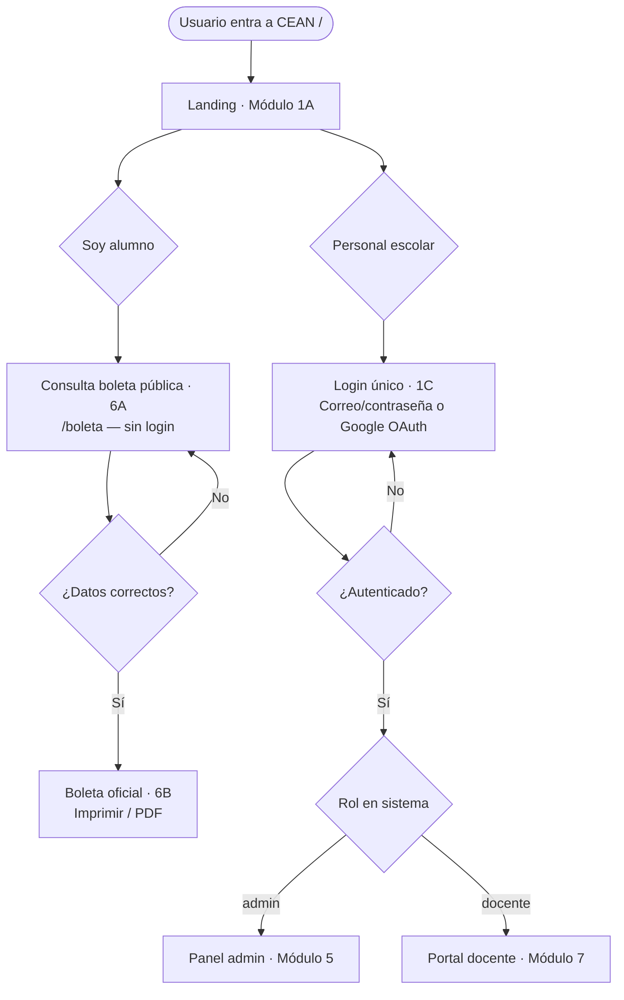
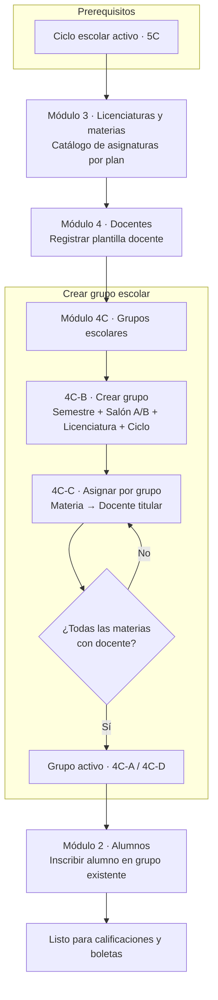
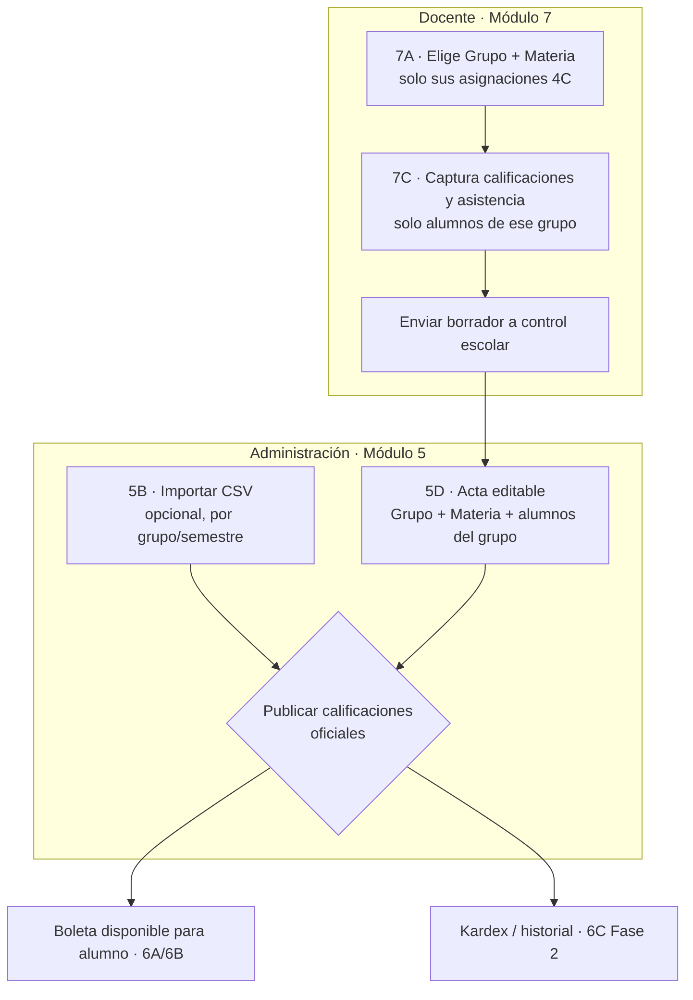
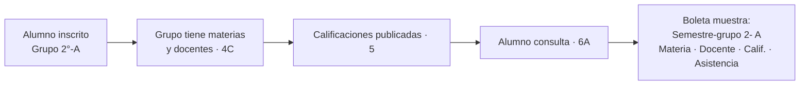
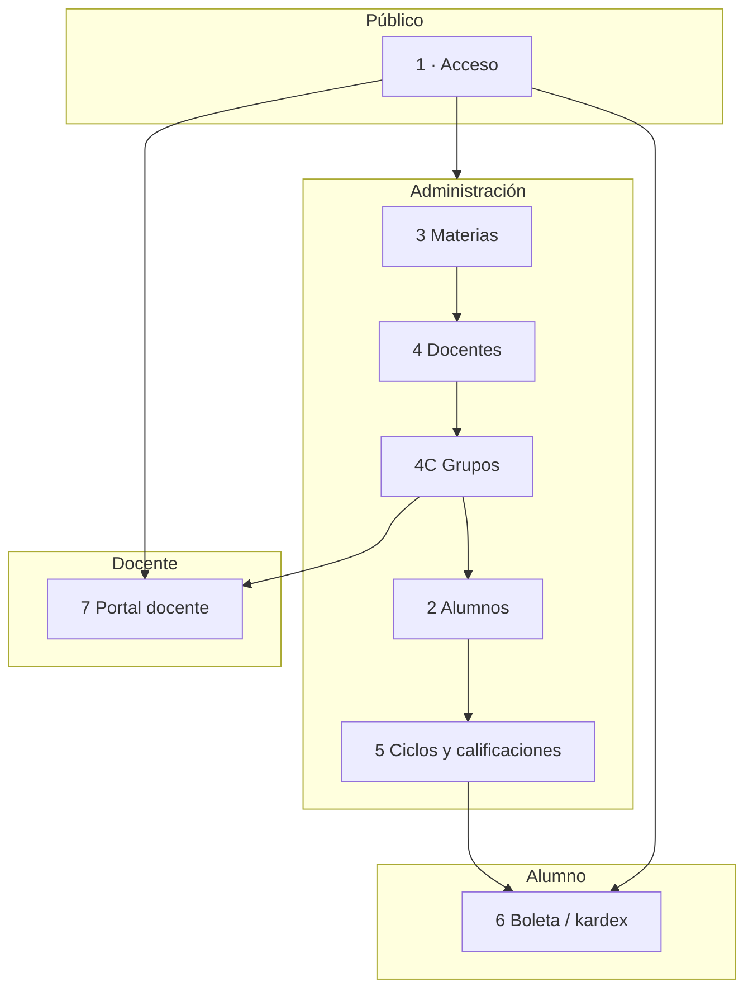
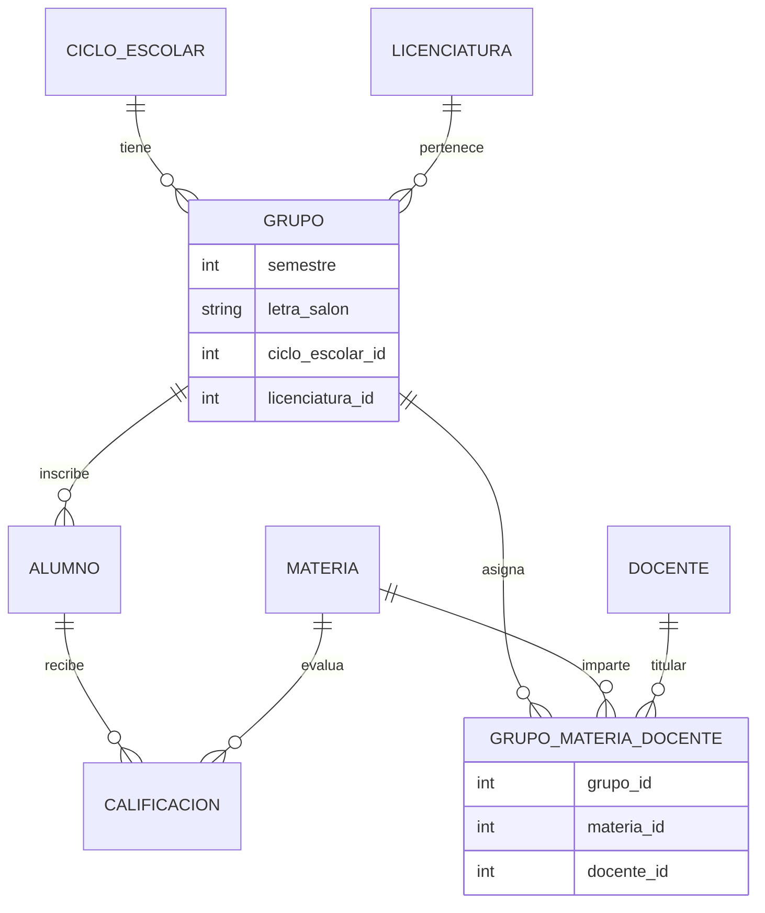

# CEAN — Diagramas de flujo del proceso

Documentación del flujo operativo del sistema, alineada con `DESIGN.md`, `prompts.md` y la arquitectura Laravel objetivo.

**Orden académico clave:** Materias (3) → Docentes (4) → **Grupos (4C)** → Alumnos (2) → Calificaciones (5 / 7)

---

## 1. Entrada al sistema (público)



| Perfil | Autenticación | Destino |
|--------|---------------|---------|
| Alumno / público | **Sin login** — matrícula + fecha nacimiento | `/boleta` |
| Personal (admin o docente) | **Login único** — correo/contraseña o Google OAuth | `/login` → redirección por rol |

---

## 2. Configuración académica (administración)

Prerequisito: **ciclo escolar activo** (Módulo 5C).



### Ejemplo concreto

| Paso | Acción | Resultado |
|------|--------|-----------|
| 1 | Crear materias del 2° semestre | Didáctica Matemáticas, Lengua… |
| 2 | Registrar Mtro. Hernández | Docente en plantilla |
| 3 | Crear **2°-A TELESECUNDARIA** | Grupo escolar |
| 4 | Asignar Matemáticas → Hernández en **2°-A** | Asignación grupo + materia + docente |
| 5 | Crear **2°-B** y asignar Matemáticas → **otro docente** | Mismo semestre, distinto salón |
| 6 | Inscribir a Ana García en **2°-A** | Alumno ligado al grupo |

### Concepto: Grupo escolar

| Elemento | Ejemplo | Dónde se define |
|----------|---------|-----------------|
| Grupo escolar | `2°-A · TELESECUNDARIA · 2023-2024` | Módulo 4C |
| Asignación | Didáctica Matemáticas → Mtro. Hernández · Grupo 2°-A | Módulo 4C-C |
| Alumno inscrito | Ana García → Grupo 2°-A | Módulo 2 |
| Boleta semestre-grupo | `2- A` (semestre + letra salón) | Derivado del grupo |

**Regla:** no se crean grupos al registrar alumnos. Primero **4C**, luego **2**.

---

## 3. Calificaciones (docente + administración)



### Permisos por perfil

| Acción | Docente | Administración |
|--------|---------|----------------|
| Capturar borrador | Sí (su grupo + materia) | Sí (cualquier grupo) |
| Publicar oficial | No | Sí |
| Crear grupos / asignar docentes | No | Sí |
| Importar CSV global | No | Sí |
| CRUD alumnos | No | Sí |

---

## 4. Vista del alumno (consulta de boleta)



**En la boleta impresa (6B):**

- **Semestre-grupo:** `2- A` — semestre + letra del salón
- **Licenciatura:** párrafo académico aparte
- **Docente titular:** por materia (desde asignación 4C)
- **Reprobatoria:** calificación &lt; 6 · **Asistencia baja:** &lt; 80%

---

## 5. Mapa de módulos por perfil



---

## 6. Modelo de datos objetivo (Laravel)



**Estado actual en código:** parcial — `alumnos.grupo` es texto (letra); faltan tablas `grupos` y `grupo_materia_docente`. Ver `prompts.md` Módulo 4C.

---

## 7. Secuencia para diseño en Stitch

```
1. DESIGN.md + logo CEAN
2. Shells 0A (admin), 0B (docente), 0C (alumno)
3. Módulo 1 — Acceso
4. Módulo 3 → 4 → 4C → 2 → 5  (orden académico)
5. Módulo 7 — Portal docente
6. Módulo 6 — Portal / boleta alumno
```

---

## Referencias

| Archivo | Contenido |
|---------|-----------|
| [DESIGN.md](./DESIGN.md) | Identidad visual, perfiles, responsive |
| [prompts.md](./prompts.md) | Prompts Stitch por módulo |
| [README.md](../../README.md) | Estado implementado en Laravel (Fase 1) |
